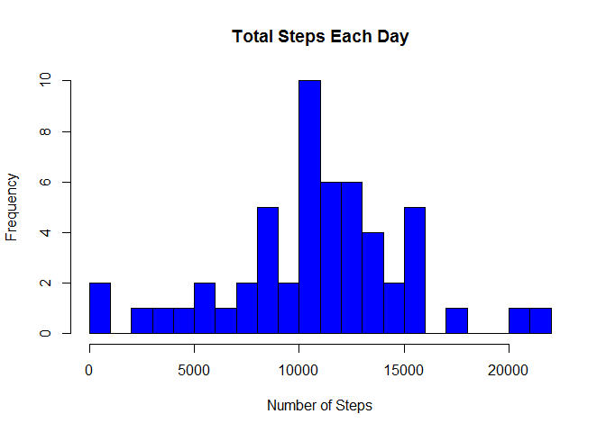
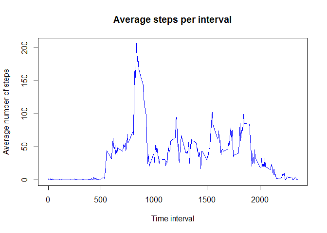
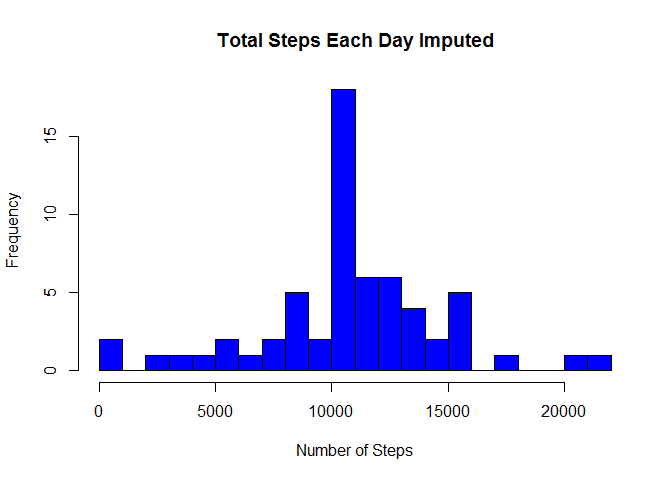
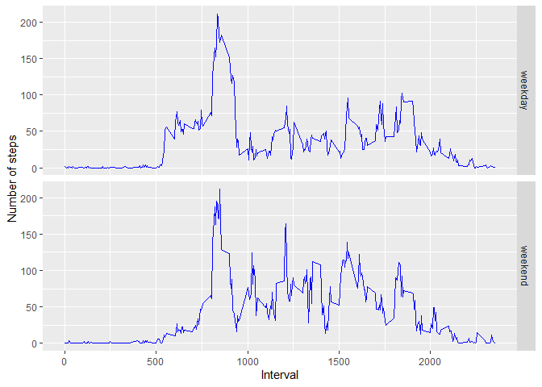

## Introduction

It is now possible to collect a large amount of data about personal movement using activity monitoring devices such as a Fit bit, Nike Fuelband, or Jawbone Up. These type of devices are part of the “quantified self” movement – a group of enthusiasts who take measurements about themselves regularly to improve their health, to find patterns in their behavior, or because they are tech geeks. But these data remain under-utilized both because the raw data are hard to obtain and there is a lack of statistical methods and software for processing and interpreting the data.

This assignment makes use of data from a personal activity monitoring device. This device collects data at 5 minute intervals through out the day. The data consists of two months of data from an anonymous individual collected during the months of October and November, 2012 and include the number of steps taken in 5 minute intervals each day.

The data for this assignment can be downloaded from the course web site:

* Dataset: [Activity monitoring data](https://d396qusza40orc.cloudfront.net/repdata%2Fdata%2Factivity.zip) 

The variables included in this dataset are:

steps: Number of steps taking in a 5-minute interval (missing values are coded as 𝙽𝙰) </br>
date: The date on which the measurement was taken in YYYY-MM-DD format </br>
interval: Identifier for the 5-minute interval in which measurement was taken </br>
The dataset is stored in a comma-separated-value (CSV) file and there are a total of 17,568 observations in this dataset.

## 1. Load data

```r
library(ggplot2)
library(dplyr)
library(lubridate)
```

```r
unzip("activity.zip")
data<-read.csv("activity.csv")
```
## Processing data
(Converting the “date” variable to a Date)

```r
data$date <- as.Date(data$date, format = "%Y-%m-%d")
```

## 2. Calculate the total number of steps taken per day

```r
day_steps <- aggregate(steps ~ date, data, sum)
hist(day_steps$steps, main = ("Total Steps Each Day"),breaks = 30, col="blue",xlab="Number of Steps")
```

<!-- -->

## 3. Calculate and report the mean and median of the total number of steps taken per day

```r
# Mean
mean(day_steps$steps)
```

```
## [1] 10766.19
```

```r
# Median
median(day_steps$steps)
```

```
## [1] 10765
```

## 4. What is the average daily activity pattern?

```r
interval_steps <- data %>% 
  group_by(interval) %>% 
  summarise(mean = mean(steps, na.rm = TRUE))
plot(interval_steps,col="blue", type = 'l', main = "Average steps per interval",
     xlab = "Time interval", ylab = "Average number of steps")
```

<!-- -->


## 5. The 5-minute interval with maximum number of steps is as follows:

```r
m<-interval_steps[which.max(interval_steps$mean),]$interval
m
```

```
## [1] 835
```
### The interval 835 has maximum steps ie 206.1698113

## 6. Imputing missing values

```r
summary(data)
```

```
##      steps             date               interval     
##  Min.   :  0.00   Min.   :2012-10-01   Min.   :   0.0  
##  1st Qu.:  0.00   1st Qu.:2012-10-16   1st Qu.: 588.8  
##  Median :  0.00   Median :2012-10-31   Median :1177.5  
##  Mean   : 37.38   Mean   :2012-10-31   Mean   :1177.5  
##  3rd Qu.: 12.00   3rd Qu.:2012-11-15   3rd Qu.:1766.2  
##  Max.   :806.00   Max.   :2012-11-30   Max.   :2355.0  
##  NA's   :2304
```
As we can see there are 2304 NA's present in only "Steps" column of the data


```r
interval_means <- sapply(data$interval, 
                         function(x) subset(interval_steps, interval == x)$mean)
miss <- is.na(data$steps)

imputed <- data
imputed[miss, ]$steps <- interval_means[miss]
summary(imputed)
```

```
##      steps             date               interval     
##  Min.   :  0.00   Min.   :2012-10-01   Min.   :   0.0  
##  1st Qu.:  0.00   1st Qu.:2012-10-16   1st Qu.: 588.8  
##  Median :  0.00   Median :2012-10-31   Median :1177.5  
##  Mean   : 37.38   Mean   :2012-10-31   Mean   :1177.5  
##  3rd Qu.: 27.00   3rd Qu.:2012-11-15   3rd Qu.:1766.2  
##  Max.   :806.00   Max.   :2012-11-30   Max.   :2355.0
```

## 7. Calculate the total number of steps taken per day in imputed data

```r
i_day_steps <- aggregate(steps ~ date, imputed, sum)
hist(i_day_steps$steps, main = ("Total Steps Each Day Imputed"),breaks = 30, col="blue",xlab="Number of Steps")
```

<!-- -->

## Calculate and report the mean and median of the total number of steps taken per day in imputed data

```r
# Mean
mean(i_day_steps$steps)
```

```
## [1] 10766.19
```

```r
# Median
median(i_day_steps$steps)
```

```
## [1] 10766.19
```

## 8. Are there differences in activity patterns between weekdays and weekends?

```r
day_week <- function(date) {
  wday <- wday(date)
  is_weekend <- wday == 1 | wday == 6
  
  day_week <- character(length = length(date))
  day_week[is_weekend] <- "weekend"
  day_week[!is_weekend] <- "weekday"
  
  return(as.factor(day_week))
}

imputed <- imputed %>% mutate(day_week = day_week(date))
```
Now with dates categorized as weekday and weekend we can easily construct the plot

```r
interval_imputed <- imputed %>% 
  group_by(interval, day_week) %>% 
  summarize(mean = mean(steps))
library(ggplot2)
g <- ggplot(interval_imputed, aes(interval, mean))+ facet_grid(day_week ~ .)+ geom_line(color="blue")+xlab("Interval") + ylab("Number of steps")
g
```

<!-- -->
